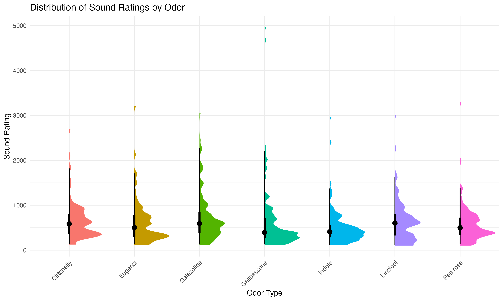
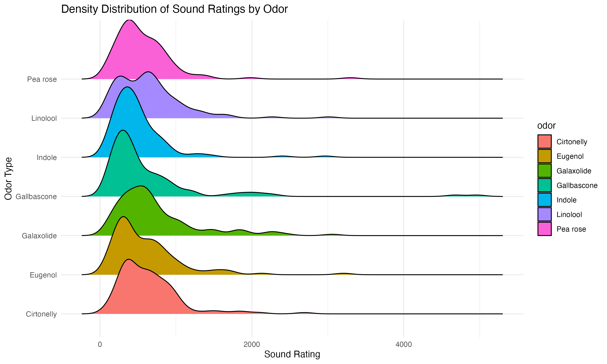
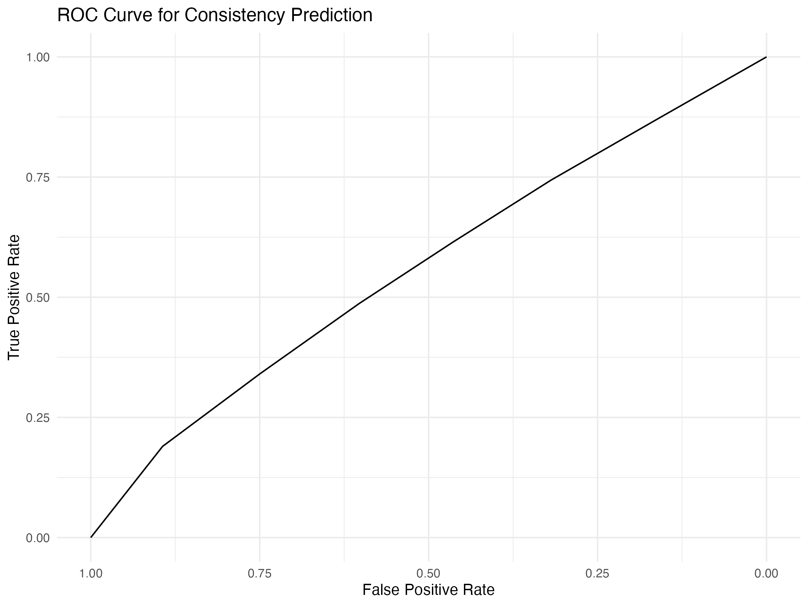
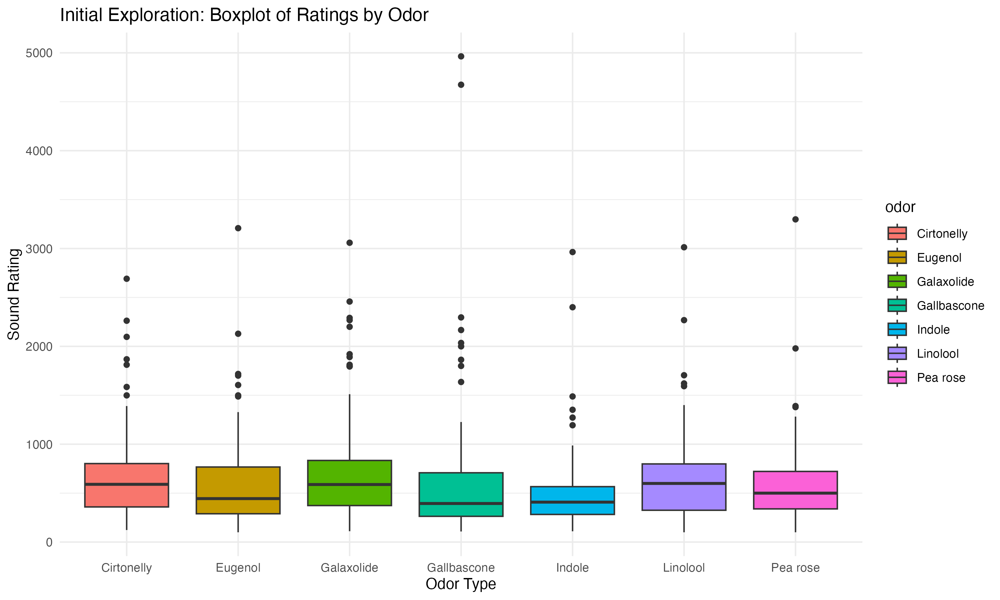

# README: ניתוח סטטיסטי עבור קישורי ריח-צליל

## סקירה כללית
פרויקט זה מנתח את הקשר בין ריחות לתפיסת צלילים. התהליך כולל עיבוד מקדים, חישוב סטטיסטיקות תיאוריות, ביצוע רגרסיות ויצירת ויזואליזציות ומדדים מתקדמים כמו עקומת ROC. 
נתונים אלו נלקחו מהניסוי הראשון של מחקר הדוקטורט שלי. אלו נתונים שמציגים את ההתאמות שביצעו 40 נבדקים על 7 ריחות שונים, ״ללא שם״, שנוצרו במעבדה בשביל הניסוי. משימת הנבדקים היתה להריח כל אחד משבעת הריחות תוך שהם מאזינים לצליל מונוטוני באוזניות, הנבדקים שלטו בגובה הצליל בלבד והיה עליהם להתאים את הצליל לריח אותו הריחו בכל פעם. כל נבדק הריח את כל הריחות בשלושה סבבים שונים. כלומר, כל אחד ביצע 21 הרחות סה״כ. העקביות נבדקה בין הנבדקים ובתוך הנבדקים.

---

## Research Question
Given the challenge of defining and categorizing odors, this study explores whether consistent crossmodal associations can be established between odors and perceived sound characteristics. Specifically, I ask:

Can certain odors be consistently associated with specific pitch perceptions across individuals, providing a structured sensory framework for crossmodal interactions between olfaction and audition?

This question is complex and meaningful because if a consistent relationship is found, it could have implications for sensory integration research, improving understanding of how the human brain processes multisensory stimuli. Additionally, such findings could inform applications in marketing (e.g., scent branding), virtual reality, and sensory substitution technologies.

---


## נתונים ומבנה
- **קובץ נתונים**: `just data exp1.xlsx`
  - דירוגי גובה הצליל המתאים לריח בסבבים שונים, לפי משתתפים ולפי ריח (תוך ובין נבדקי).

- **קבצי פלט**:
  - `rating_distribution.png`: גרף התפלגות דירוגי הצלילים.
  - `rating_density_ridges.png`: גרף צפיפות דירוגים.
  - `roc_curve.png`: עקומת ROC לניבוי עקביות.
  - `initial_exploration.png`:  כחלק ממשימת בדיקת הנתונים הראשונית - גרף הצגת נתונים ראשוני.

---

## התקנה
התקנת חבילות הדרושות:
```r
if (!requireNamespace("ggridges", quietly = TRUE)) install.packages("ggridges")
if (!requireNamespace("skimr", quietly = TRUE)) install.packages("skimr")
```

טעינת ספריות:
```r
library(tidyverse)
library(ggplot2)
library(ggdist)
library(pROC)
library(ggridges)
library(skimr)
```

---

## תהליך הניתוח
1. **עיבוד נתונים**:
   - ניקוי וסינון ערכים קיצוניים באמצעות הפונקציה `preprocess_data`.

2. **הצגת נתונים מקדימה**:
   - יצירת גרף להצגת ממוצעי הדירוגים לפי סוגי הריחות.
   - ניתוח ראשוני שמאפשר להעלות השערות לגבי קשרים בין המשתנים.
   - גרף הפלט נשמר כ-`initial_exploration.png`.

3. **סטטיסטיקה תיאורית**:
   - חישוב סטיית תקן ומדד עקביות יחסי.
   - קיבוץ הנתונים לפי משתתף וריח.

4. **ניתוחים סטטיסטיים**:
   - רגרסיה ליניארית: `rating_z ~ odor`.
   - בדיקת נורמליות (מבחן Shapiro-Wilk).
   - רגרסיה לוגיסטית: `high_consistency ~ odor`.

5. **תחזיות ו-ROC**:
   - חישוב הסתברויות חזויות והפקת עקומת ROC.

6. **ויזואליזציה**:
   - יצירת גרפים להצגת התפלגות הדירוגים וצפיפות הנתונים.
   - שמירת הפלטים בקבצי PNG.

7. **סיכום פלט**:
   - תוצאות הניתוחים והבדיקות מוצגות בסיכום מודפס.

---

## שאלת מחקר
שאלת המחקר: האם קיימת עקביות בדירוגי צלילים עבור ריחות מסוימים? האם ניתן לקבוע קשר בין ריח לתפיסת צליל בהקשר של אינטראקציה בין-חושית (crossmodal)?

---

## הרצה
1. הנחת קובץ הנתונים (`just data exp1.xlsx`) בתיקיית העבודה.
2. הרצת הסקריפט בסביבת R.
3. הצגת הגרפים וצפייה בתוצאות הסיכום.

---

## דוגמה לפלט
- **גרפים**:
  - 
  - 
  - 
  - 

- **תוצאות מודפסות**: סיכומי רגרסיות, בדיקת נורמליות וערך ה-AUC.

---


## מחבר
אביתר כהן

